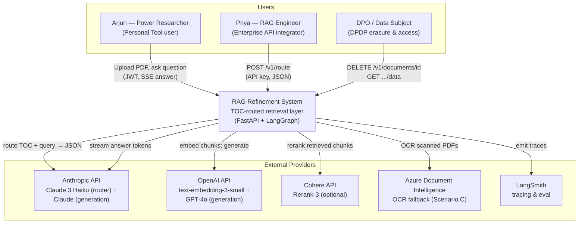
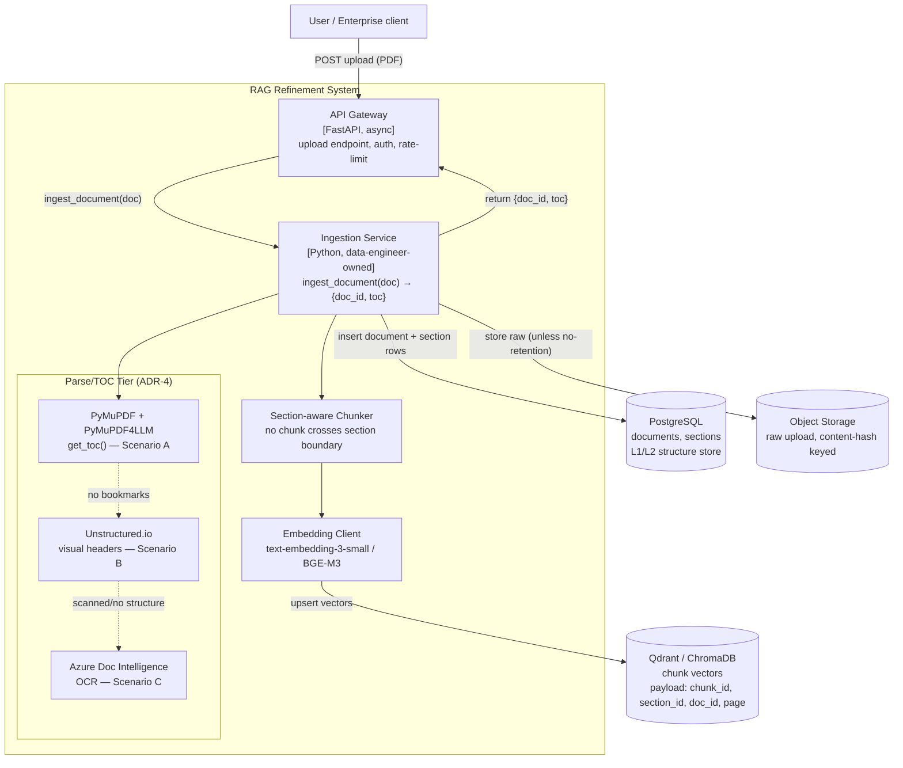
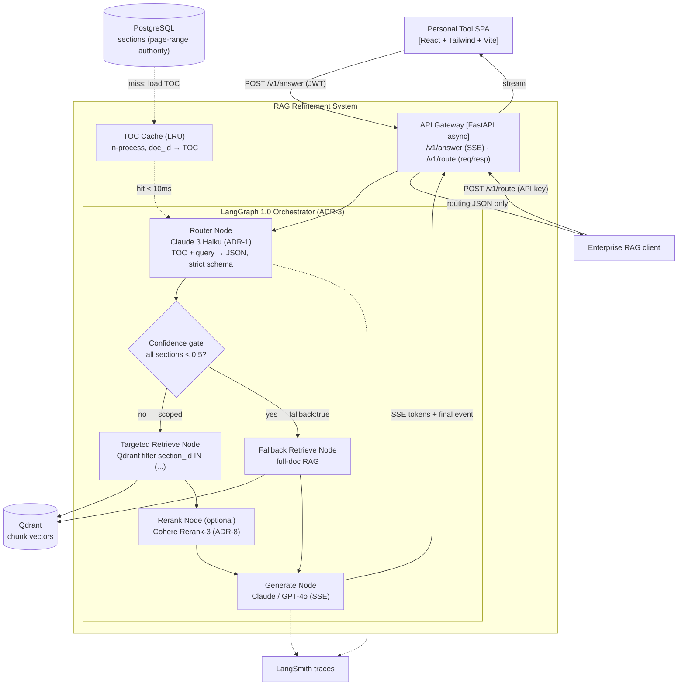

<!-- Generated by Phase 1 (solution-architect) | Task: TODO-01 | Date: 2026-06-06 -->
<!-- Source of truth: PRD.md v2.0 + docs/execution/_common_context.md (ADR-1..ADR-10) + phase1_architect_brief.md -->

# High-Level Design (HLD) — RAG Refinement System

**Version:** 1.0
**Date:** 2026-06-06
**Phase:** 1 — Solution Architecture
**Status:** APPROVED (consensus BINARY gate, zero open items — see Section 12)
**Author:** solution-architect
**Traceability:** Every architectural claim below is traced to a PRD FR/NFR or an ADR. No claim is invented outside that scope.

> This HLD is THE blueprint for Phase B. Because the architecture sub-pipeline runs here, main-pipeline Phase A + A.5 are satisfied by this document plus `context_delivery_plan.md`. The 10 ADRs in `_common_context.md` are honored verbatim — this HLD reuses them and does not contradict them.

---

## Table of Contents

1. [Architecture Overview & Scope](#1-architecture-overview--scope)
2. [C4 Level 1 — System Context](#2-c4-level-1--system-context)
3. [C4 Level 2 — Containers (Ingestion + Query Pipelines)](#3-c4-level-2--containers-ingestion--query-pipelines)
4. [Component Architecture & Data Model](#4-component-architecture--data-model)
5. [Architecture Decision Records (ADR-1..ADR-10)](#5-architecture-decision-records-adr-1adr-10)
6. [Data Structures & Algorithms (DSA) per Component](#6-data-structures--algorithms-dsa-per-component)
7. [Interface Contracts (Router, REST, Data Stores)](#7-interface-contracts-router-rest-data-stores)
8. [STRIDE + OWASP LLM Top-10 Threat Surface](#8-stride--owasp-llm-top-10-threat-surface)
9. [NFR Compliance Map](#9-nfr-compliance-map)
10. [Capacity Estimate (Little's Law)](#10-capacity-estimate-littles-law)
11. [Resolved Open Architectural Questions (OAQ-1..OAQ-6)](#11-resolved-open-architectural-questions-oaq-1oaq-6)
12. [Consensus Verdict](#12-consensus-verdict)

---

## 1. Architecture Overview & Scope

The RAG Refinement System is a **document-structure-aware retrieval layer** (PRD Section 1). The architectural thesis is *"scope before search"*: a TOC-based Router Agent selects relevant document sections **before** vector retrieval, so retrieval is filtered to those sections only. This realizes the product's three measurable wins — 40-70% token reduction (PRD OKR1.2), reduced hallucination from context noise (NFR-004), and interpretable routing (NFR-011).

### 1.1 Two Product Surfaces (PRD Section 7)

| Surface | Delivery | Generation? | Auth |
|---------|----------|-------------|------|
| **Personal Tool** | React SPA → `POST /v1/answer` (SSE streamed) | Yes — generation LLM streams cited answer | OAuth2 / JWT (ADR-7) |
| **Enterprise Refinement API** | `POST /v1/route` (request/response) | **No** — routing-only, never calls generation LLM | API key + rotation (ADR-7) |

This split is a binding AGREED CONTRACT (team-alignment ai-engineer ↔ python-backend-engineer): the Router is an in-process async LangGraph function; `/v1/route` performs no generation.

### 1.2 Three-Stage Pipeline (PRD Section 8.1)

```
STAGE 1 INGESTION:  PDF → Parse/TOC → Doc→Section→Chunk hierarchy → Qdrant(vectors) + Postgres(structure)
STAGE 2 ROUTING:    Query → Router Agent (Claude 3 Haiku) → {sections[], page_ranges[], confidence[], fallback}
STAGE 3 RETRIEVAL:  Qdrant filter section_id IN (selected) → [optional Cohere Rerank] → Generation LLM → Answer
```

### 1.3 In-Scope / Out-of-Scope

**In scope (this HLD):** system & container architecture, data model, router/REST/data-store interface contracts, DSA choices, threat surface, NFR map, capacity math, and resolution of the 6 OAQs. **Out of scope:** implementation code, OpenAPI YAML (Phase 1.5 / TODO-02), UI design tokens (Phase 3), detailed test cases (Phase D). Non-goals per PRD 9.5 (no foundation-model build, no real-time streaming ingestion, no media analysis) are inherited unchanged.

---

## 2. C4 Level 1 — System Context



**Context notes:** The system is the single trust boundary between untrusted inputs (uploaded documents + user queries — both treated as untrusted per threat-modeling contract) and external LLM/embedding providers. Provider API keys are injected via secret manager, never in code (NFR-007). The DPDP data-subject actor (U3) is first-class because erasure/access are architectural, not bolt-on (FR-025/026, brief §4).

---

## 3. C4 Level 2 — Containers (Ingestion + Query Pipelines)

### 3.1 Container Diagram — Ingestion Pipeline



Ingestion is **idempotent on content hash**; re-upload reuses `doc_id` (AGREED CONTRACT, python-backend-engineer ↔ data-engineer). The Parse/TOC tier degrades A → B → C; Scenario C with no usable structure marks the document `fallback_only` (see OAQ-6).

### 3.2 Container Diagram — Query Pipeline (LangGraph state machine)



**Key invariant:** the Router Node (Claude 3 Haiku) **never** calls the generation LLM (GEN node). For `/v1/route`, the graph terminates after ROUTER/COND and returns routing JSON — the RET/RERANK/GEN path is not executed. This enforces the routing-only contract at the graph topology level.

---

## 4. Component Architecture & Data Model

### 4.1 Three-Level Hierarchy (PRD 8.4, ADR-2 + ADR-10)

```
Level 1 — Document   (PostgreSQL: documents)
  Level 2 — Section  (PostgreSQL: sections)  ← page-range authority
    Level 3 — Chunk  (Qdrant point)          ← vector + payload
```

Only Level-3 chunks are embedded into Qdrant. Structure (L1/L2) lives in PostgreSQL and feeds both the router and the Qdrant payload filter. `section_id` is the **universal join/filter key** across all three levels.

### 4.2 PostgreSQL schema (structure store, ADR-10)

```
documents(doc_id PK, content_hash, title, total_pages, domain, tenant_id,
          residency_region, fallback_only BOOL, created_at)
sections (section_id PK, doc_id FK→documents, title, level INT,
          page_start INT, page_end INT, summary, pii_flags JSONB)
```

`page_start`/`page_end` in `sections` are the **single source of truth** for page ranges (resolves OAQ-3). `tenant_id` + `residency_region` support multi-tenancy and India data-residency (FR-028, OAQ-5). `pii_flags` carries `x-pii` markers (FR-029).

### 4.3 Qdrant payload (vector store, ADR-2)

```
point {
  id: chunk_id,
  vector: <embedding>,
  payload: { chunk_id, section_id, doc_id, page, tenant_id }
}
```

Targeted retrieval = Qdrant search with payload filter `section_id IN (router-selected)` AND `tenant_id = caller` (AGREED CONTRACT python-backend-engineer ↔ database-engineer). Tenant scoping is per-collection namespace + payload filter (OAQ-5). No chunk crosses a section boundary mid-sentence (FR-003).

### 4.4 Component responsibilities

| Component | Owner | Responsibility | FR/NFR |
|-----------|-------|----------------|--------|
| API Gateway | python-backend-engineer | HTTP, auth, rate-limit, RFC-7807 errors, SSE framing | FR-001/007/010/018, NFR-010/015 |
| Ingestion Service | data-engineer | `ingest_document` → parse/TOC/chunk/embed/upsert | FR-001/002/003/004 |
| Router Node | ai-engineer | TOC+query → routing JSON, confidence threshold, fallback flag | FR-005/009, NFR-001/003/005 |
| Retrieve Nodes | python-backend-engineer | scoped + fallback Qdrant retrieval | FR-006/009 |
| Generate Node | ai-engineer | streamed cited generation | FR-007/008/018, NFR-004/011 |
| TOC Cache | python-backend-engineer | in-process LRU, <10ms TOC lookup | NFR-001 |
| Compliance handlers | python-backend-engineer | erasure/access/no-retention/residency | FR-025..029, NFR-014 |

---

## 5. Architecture Decision Records (ADR-1..ADR-10)

These ADRs are reused verbatim from `_common_context.md`; FR↔NFR traceability is added per the architect brief. No ADR is re-litigated.

### ADR-1 — Router LLM
- **Chosen:** Claude 3 Haiku.
- **Why:** Sub-300ms routing; strong structured-JSON adherence for `{section_id, confidence}`; same vendor as generation (one key/SLA); ~$0.0001-0.001/call.
- **Rejected:** GPT-4o-mini (splits vendor/billing, no quality edge); fine-tuned router (premature, deferred to Phase 4).
- **Traces:** FR-005 (router), FR-002 (pseudo-TOC) → NFR-001 (100-300ms), NFR-003 (recall ≥85%).

### ADR-2 — Vector database
- **Chosen:** Qdrant (prod) / ChromaDB (dev).
- **Why:** Rich payload metadata filtering on `section_id`/`page` — the core "scope before search" mechanism; Rust performance; local Chroma = near-zero dev friction.
- **Rejected:** Pinecone (cost/lock-in); pgvector (filter perf degrades at scoped-search scale); Weaviate (heavier ops).
- **Traces:** FR-004 (indexing), FR-006 (targeted retrieval), FR-027 (no-retention purge) → NFR-006 (scale), NFR-008 (access control).

### ADR-3 — Agent orchestration
- **Chosen:** LangGraph 1.0 (stable Oct 2025).
- **Why:** First-class conditional routing + checkpointing for Router→Retrieve→Generate with a fallback branch; production-ready.
- **Rejected:** Raw LangChain (no graph model); custom orchestration (reinvents checkpointing); LlamaIndex agents (less branch control).
- **Traces:** FR-005, FR-006, FR-009 (fallback branch) → NFR-013 (graceful degradation).

### ADR-4 — PDF parsing / TOC extraction
- **Chosen:** PyMuPDF + PyMuPDF4LLM (primary) → Unstructured.io (fallback) → Azure Document Intelligence (OCR).
- **Why:** `get_toc()` yields native bookmark TOC for free/fast (Scenario A); tiered fallbacks cover B/C without over-paying per document.
- **Rejected:** pdfplumber (no TOC primitive); PyPDF2 (weak extraction).
- **Traces:** FR-001 (parse), FR-002 (TOC A/B/C), FR-017 (OCR) → NFR-013 (degradation).

### ADR-5 — API framework
- **Chosen:** FastAPI.
- **Why:** Async I/O for concurrent ingestion/routing; auto OpenAPI 3.1 (drives Phase 1.5 contract); Pydantic boundary validation.
- **Rejected:** Flask (sync-first, manual schema); Django (ORM/admin weight unneeded).
- **Traces:** FR-001/007/010/018/025/026 → NFR-010 (OpenAPI 3.1, RFC-7807), NFR-009 (health/ready).

### ADR-6 — Embeddings
- **Chosen:** OpenAI text-embedding-3-small (primary) + BGE-M3 (multilingual fallback).
- **Why:** Best cost/quality at chunk scale; BGE-M3 covers non-English docs without a second paid provider.
- **Rejected:** ada-002 (superseded); Cohere embed (third vendor, no gain).
- **Traces:** FR-004 (embed), FR-023 (multilingual) → NFR-012 (i18n).

### ADR-7 — Authentication
- **Chosen:** API keys + rotation (enterprise) + OAuth2/JWT (personal tool).
- **Why:** API keys = standard enterprise integration contract with simple rotation; OAuth2/JWT fits SPA session model.
- **Rejected:** Session-only (no M2M API); mTLS (operationally heavy for MVP).
- **Traces:** FR-010 (/v1/route), FR-007 (personal tool) → NFR-015 (auth), NFR-007 (secrets).

### ADR-8 — Reranker
- **Chosen:** Cohere Rerank-3 (optional, post-route, per-request toggle).
- **Why:** Documented 20-35% precision lift; toggleable to control cost.
- **Rejected:** Self-hosted cross-encoder (GPU/ops burden); none (accuracy left on table).
- **Traces:** FR-016 (rerank) → NFR-003 (recall), accuracy goals (PRD 15.2).

### ADR-9 — Personal-tool frontend
- **Chosen:** React + TailwindCSS + Vite.
- **Why:** Mature streaming-UI ecosystem for token-by-token answers; Tailwind maps to Phase 3 design tokens; Vite fast dev loop.
- **Rejected:** Next.js (SSR weight unneeded); Angular (heavier).
- **Traces:** FR-007/008/011/012/018 → NFR-011 (interpretability).

### ADR-10 — Section/document metadata store
- **Chosen:** PostgreSQL (alongside Qdrant for chunk vectors).
- **Why:** Relational L1/L2 hierarchy + ACID + metadata-filter joins feeding the router; clean separation of structure store (Postgres) from vector store (Qdrant).
- **Rejected:** Mongo (weaker relational joins); Qdrant-only (no relational TOC/management queries).
- **Traces:** FR-003 (hierarchy), FR-006 (filter), FR-008 (citations), FR-025/026 (erasure/access) → NFR-014 (compliance).

---

## 6. Data Structures & Algorithms (DSA) per Component

| Component | Data structure / algorithm | Rationale | Complexity |
|-----------|----------------------------|-----------|-----------|
| **TOC page-range lookup** | **Interval tree** keyed on `(page_start, page_end)` per `doc_id` | Map a page or page-range to its owning section(s) in log time; supports the citation check "each cited page falls within a router-selected section" (FR-008 BDD) | Build O(n log n), query O(log n + k) |
| **TOC cache** | **LRU cache** (in-process, `doc_id → TOC`), bounded capacity | NFR-001 cached TOC lookup <10ms; bounded memory; evict cold documents | get/put O(1) |
| **Section selection** | **Confidence-thresholded top-K** over router scores | Include score ≥0.7; include 0.5-0.7 only if no high-confidence section; exclude <0.5; all <0.5 → fallback (PRD 8.3) | O(s log s) sort over s sections, s small |
| **Targeted retrieval** | **Qdrant payload filter** `section_id IN (selected)` + HNSW ANN within filter | Restricts ANN search to scoped sections — the token/accuracy win (FR-006); HNSW gives sublinear vector search | ~O(log N) ANN over filtered subset |
| **Ingestion dedup** | **Content-hash map** (`sha256(content) → doc_id`) | Idempotent re-upload reuses `doc_id` (AGREED CONTRACT); O(1) dedup check | O(1) |
| **Section-aware chunking** | **Boundary-respecting sliding window** over section page spans | No chunk crosses a section boundary (FR-003); window slides within `[page_start, page_end]` | O(t) over t tokens |
| **Header detection (Scenario B)** | **Font-feature heuristic + rule pass** (size/bold/position) then LLM refine | Generate pseudo-TOC where bookmarks absent (FR-002, ADR-4) | O(b) over b text blocks |
| **Erasure cascade** | **Outbox + reconciliation sweep set** of `(doc_id, store)` tombstones | Atomic-enough two-store delete; sweep removes orphan vectors (OAQ-2) | O(c) over c chunks |
| **Multi-doc routing (FR-014)** | **Per-document map-reduce** over TOCs, then merge top-K | Router runs per-document; results merged with global confidence sort (OAQ-4) | O(d · s log s) over d docs |

**Worked example (interval tree, citation validation):** for a router-selected section set and a generated citation page `p`, an interval-tree query `stab(p)` returns the owning section in O(log n); if no selected section owns `p`, the citation is rejected — enforcing the FR-008 invariant "each cited page falls within a router-selected section" without a linear scan of the TOC.

---

## 7. Interface Contracts (Router, REST, Data Stores)

These contracts are the binding skeleton consistent with the team-alignment AGREED CONTRACTS. The full OpenAPI 3.1 YAML is produced in Phase 1.5 (TODO-02); this section fixes the shapes that Phase 1.5 must honor.

### 7.1 Router output contract (in-process async function)

```
RouterOutput = {
  relevant_sections: [{ section_id, title, page_start, page_end, confidence }],
  page_ranges:       [[page_start, page_end], ...],
  confidence:        [float, ...],
  fallback:          bool,
  routing_time_ms:   int,
  rationale:         string   # "why did you look here?" — feeds FR-012 panel
}
```

The router is an **in-process async LangGraph function** (AGREED CONTRACT ai-engineer ↔ python-backend-engineer). It returns this object; it never calls the generation LLM. `rationale` is included to satisfy NFR-011 interpretability and the FR-012 explainability panel.

### 7.2 `POST /v1/route` — routing-only (enterprise, request/response)

```
Request:  { document_id, query, confidence_threshold=0.7, max_sections=3 }
Response: { query_id, relevant_sections[], page_ranges[], confidence[],
            routing_time_ms, fallback, estimated_token_reduction }
Auth:     API key (Bearer)        Errors: RFC-7807 problem+json
```
No generation. The LangGraph graph terminates after the confidence gate. (FR-010, NFR-010.)

### 7.3 `POST /v1/answer` — SSE generation (personal tool)

```
Request:  { document_id, query }           Auth: JWT Bearer
Stream:   text/event-stream — token events ...
Final event: { answer,
               citations: [{ section_title, page_start, page_end }],
               routing:   { sections[], confidence[], fallback } }
Errors:   RFC-7807 problem+json
```
(FR-007/008/018, NFR-010/011.)

### 7.4 Compliance endpoints (DPDP)

```
DELETE /v1/documents/{id}        → erasure cascade (Postgres + Qdrant + object store)  [FR-025]
GET    /v1/documents/{id}/data   → personal data held for the document (x-pii flagged) [FR-026, FR-029]
no_retention flag (per-request)  → purge raw+chunks+sections after answer              [FR-027]
tenant residency config          → region-pinned storage selection                     [FR-028]
```

### 7.5 Data-store contract

```
PostgreSQL = L1/L2 structure store (documents, sections) — page-range authority
Qdrant     = L3 chunk vectors, payload {chunk_id, section_id, doc_id, page, tenant_id}
section_id = universal join/filter key across all three levels
Retrieval  = Qdrant search filter (section_id IN router-selected) AND (tenant_id = caller)
```
(AGREED CONTRACTS python-backend-engineer ↔ database-engineer, ↔ data-engineer.)

---

## 8. STRIDE + OWASP LLM Top-10 Threat Surface

Document text and user query are **untrusted inputs** (threat-modeling-specialist ↔ ai-engineer contract). STRIDE is extended with the OWASP LLM Top-10 per the build 29.9.16 mandate.

| STRIDE | Threat | Surface | Mitigation | Trace |
|--------|--------|---------|-----------|-------|
| **S**poofing | Forged API key / JWT | `/v1/route`, `/v1/answer` | API-key rotation; JWT signature + expiry validation; OAuth2 | NFR-015, ADR-7 |
| **T**ampering | RAG corpus poisoning at ingestion | Ingestion Service | Content checks on upload; reject malformed/oversized; content-hash integrity | NFR-008, OWASP LLM03 |
| **R**epudiation | No audit trail of routing/answer | Router + Generate | LangSmith traces on every run; query_id correlation | NFR-009 |
| **I**nfo disclosure | Embedding inversion on stored chunks; IDOR on `/v1/documents/{id}` | Qdrant; document endpoints | Qdrant access control + tenant isolation; ownership check (tenant_id) on every doc op | NFR-008, OWASP LLM06 |
| **D**oS | Rate-limit bypass; oversized PDF flood | API Gateway; Ingestion | Per-key rate limit; upload size/page caps; async backpressure | NFR-006 |
| **E**levation | Prompt injection in router prompt; mass-assignment | Router Node; doc endpoints | System/role separation; **strict JSON output schema, reject non-JSON**; Pydantic allow-listed fields | NFR-008, OWASP LLM01 |

**OWASP LLM Top-10 focus (answer path):** LLM01 prompt injection (router strict-JSON contract + system/role separation), LLM03 training/corpus poisoning (ingestion content checks), LLM06 sensitive-info disclosure / embedding inversion (Qdrant ACL + tenant isolation). DAST (penetration-tester) runs against staging before Phase G (AGREED CONTRACT). CERT-In 6h incident-reporting hook on security events (NFR-007).

---

## 9. NFR Compliance Map

| NFR | Target | Architectural mechanism | Status |
|-----|--------|-------------------------|--------|
| NFR-001 | Router 100-300ms; cached TOC <10ms | Claude 3 Haiku (ADR-1); LRU TOC cache (§6) | Designed |
| NFR-002 | Overhead ≤ +200ms median | TOC cache + Haiku router + scoped retrieval (smaller search) | Designed |
| NFR-003 | Router recall ≥85% MVP / ≥95% 6-mo | Confidence-thresholded top-K + golden eval set ≥20 docs (LangSmith) | Designed |
| NFR-004 | Hallucination <15% MVP | Scope-before-search noise reduction + citation grounding | Designed |
| NFR-005 | Fallback rate <20% MVP / <10% 6-mo | Confidence gate tuned on eval set; PSI drift monitoring | Designed |
| NFR-006 | Horizontal scale 10K-500K+/mo | Stateless async API; LangGraph checkpointing; Qdrant horizontal | Designed |
| NFR-007 | Secrets via secret manager | 12-factor env; never in code/repo; CERT-In hook | Designed |
| NFR-008 | OWASP LLM Top-10 hardened | §8 STRIDE+LLM map | Designed |
| NFR-009 | LangSmith traces; /health + /ready | Per-service probes; trace on every run | Designed |
| NFR-010 | OpenAPI 3.1; RFC-7807 errors | FastAPI auto-schema (ADR-5); problem+json | Designed (YAML in Phase 1.5) |
| NFR-011 | Every answer explainable | `rationale` in router output; routing payload in final SSE event | Designed |
| NFR-012 | Multilingual via BGE-M3 | Embedding fallback (ADR-6) | Designed |
| NFR-013 | Graceful degradation to full-doc RAG | Fallback branch in LangGraph (ADR-3) | Designed |
| NFR-014 | DPDP + SOC2-readiness | Erasure/access/no-retention/residency (§7.4); evidence format | Designed |
| NFR-015 | API keys + OAuth2/JWT | ADR-7; rotation | Designed |

**Routing-latency budget (NFR-001/002):** TOC lookup (cached) <10ms + router LLM 100-300ms + targeted vector search 50-150ms ⇒ added overhead +100-200ms median, within the ≤+200ms target and the <400ms MVP / <200ms 6-mo routing-latency KPI (PRD 21).

---

## 10. Capacity Estimate (Little's Law)

> Delegated to the mathematics-engineer (math-master, auto-invoked). Assumptions are stated explicitly per the brief.

**Little's Law:** `L = λ · W`, where `L` = mean concurrent in-flight requests, `λ` = arrival rate, `W` = mean service time (residence time).

### 10.1 Stated assumptions

| Symbol | Meaning | Value | Source |
|--------|---------|-------|--------|
| λ_peak | Peak arrival rate (enterprise Growth tier upper band) | 500,000 routing calls/month | PRD 6.2 / NFR-006 |
| — | Peak-to-mean concentration | assume 80% of traffic in 20% of hours (business-hours burst) | engineering default |
| W_route | Mean service time, `/v1/route` (routing only) | 0.30s (router 100-300ms + cache + I/O) | NFR-001 |
| W_answer | Mean service time, `/v1/answer` (route+retrieve+generate) | 2.5s (incl. streamed generation) | engineering default |

### 10.2 Arrival rate (convert month → second, apply burst)

- Average λ over a 730-hour month: 500,000 / (730 · 3600) ≈ **0.19 req/s**.
- Peak-hour λ with 80/20 concentration: (0.80 · 500,000) / (0.20 · 730 · 3600) ≈ **0.76 req/s** ≈ **1 req/s** design point.

### 10.3 Concurrency (Little's Law)

- Routing path: `L_route = λ_peak · W_route = 0.76 · 0.30 ≈ 0.23` concurrent requests.
- Answer path (if all peak traffic were answers): `L_answer = 0.76 · 2.5 ≈ 1.9` concurrent requests.

### 10.4 Interpretation & headroom

At the 500K/month enterprise upper band, peak concurrency is ≈0.23 (routing) to ≈1.9 (full answer) in-flight requests — comfortably served by a **single async FastAPI replica** with margin. Applying a 10× safety factor for traffic spikes and a target ≤70% utilization yields a sizing of **2 API replicas + 1 Qdrant + 1 Postgres** for MVP, with horizontal scale-out triggered when sustained `L_route` approaches the per-replica concurrency budget. This confirms NFR-006: the MVP ships at low scale while the stateless async design scales horizontally. **Bottleneck note:** the binding constraint at scale is generation throughput (W_answer ≫ W_route), not routing — so `/v1/route` (enterprise) scales further on the same footprint than `/v1/answer`.

---

## 11. Resolved Open Architectural Questions (OAQ-1..OAQ-6)

Each of the six brief §6 questions is resolved with a concrete decision. Sensible engineering defaults are used; items genuinely needing a business/product decision are marked **NEEDS USER DECISION** with a recommended option.

### OAQ-1 — No-retention vs. idempotent re-upload
**Decision:** No-retention mode and content-hash dedup are **mutually exclusive per request**. In no-retention mode the system computes only an **in-memory, salted, non-persisted** hash for the lifetime of the request and stores nothing; dedup is disabled for that request. The persisted-hash dedup path applies only to normal (retained) ingestion. This keeps FR-027 (purge everything) consistent with FR-001 idempotency without persisting a hash in the ephemeral path.

### OAQ-2 — Erasure atomicity across two stores
**Decision:** **Outbox + reconciliation sweep** (not 2PC). `DELETE /v1/documents/{id}` (1) marks the Postgres `documents` row tombstoned in a transaction and writes outbox tombstone rows for each `(doc_id, store)`; (2) a worker deletes Qdrant vectors + object-store raw; (3) a periodic reconciliation sweep removes any orphan vectors whose `doc_id` is tombstoned. Guaranteed state on mid-delete failure: the document is **immediately invisible** (Postgres tombstone makes `GET` return 404) and orphan vectors are guaranteed removed by the sweep — eventual consistency with a hard "no orphan survives a sweep" invariant. Chosen over 2PC because Qdrant has no XA transaction support.

### OAQ-3 — Router output authority (section_id vs. page)
**Decision:** **`section_id` is the only Qdrant filter key; PostgreSQL `sections.page_start/page_end` is the single source of truth for page ranges.** The router emits `page_ranges[]` for human display only; retrieval never filters on page. This prevents drift between the TOC table and vector payload. `page` remains in the Qdrant payload for citation display, but is authoritative only via the Postgres interval tree (§6).

### OAQ-4 — Multi-document routing (FR-014)
**Decision:** Router operates **per-document** (one TOC at a time) as the MVP default; FR-014 multi-document is realized by **fan-out map-reduce** — run the per-document router over each candidate document's TOC, then merge results with a global confidence sort and `max_sections` cap. The `/v1/route` contract gains an optional `document_ids[]` for the multi-doc case; single `document_id` remains the primary path. This keeps the router prompt shape stable (one TOC per invocation). FR-014 is Phase 2, so the MVP graph implements per-document; the merge layer is additive.

### OAQ-5 — Tenant isolation & residency topology
**Decision (MVP):** **Shared infrastructure with logical isolation** — Qdrant per-tenant collection namespace + payload `tenant_id` filter; PostgreSQL row-level `tenant_id` scoping on every query. India data-residency (FR-028) maps to **region-pinned collections/instances**: a tenant flagged `residency_region=IN` is provisioned on India-region Qdrant/Postgres/object-store. **NEEDS USER DECISION** for the Enterprise top tier only: whether the "dedicated infra / on-premise" option (PRD 17.2) requires **fully separate per-tenant instances** at GA. *Recommended option:* ship MVP with shared logical isolation + region-pinning; offer dedicated per-tenant instances as a paid Enterprise-tier add-on (not MVP) — this matches the PRD pricing tiers without over-building for MVP.

### OAQ-6 — Scenario-C degradation boundary
**Decision:** **Both, with a single owner.** The **Ingestion Service owns the Scenario-C decision**: if parse/TOC yields no usable structure, ingestion sets `documents.fallback_only = true` and creates **no section rows** (chunks are still embedded for full-doc RAG). At **query time**, the Router Node reads `fallback_only`; if true it short-circuits to `fallback: true` without an LLM routing call (saving latency/cost). Thus the *structural* decision is made once at ingestion and signaled via the `fallback_only` flag; the *runtime* fallback branch in LangGraph honors it. Query-time fallback also still fires when a document has a TOC but all section confidences are <0.5 (FR-009) — the two fallback triggers are independent and both route to the same Fallback Retrieve Node.

**Summary — items needing user decision:** Only **OAQ-5 (Enterprise-tier dedicated-instance topology at GA)** is flagged NEEDS USER DECISION; recommended resolution is "shared logical isolation + region-pinning for MVP, dedicated instances as a paid GA add-on." All other five OAQs are resolved with concrete engineering decisions and require no business input. This single flag is a GA-tier commercial choice, not an MVP blocker — the HLD is complete and internally consistent without it.

---

## 12. Consensus Verdict

```
CONSENSUS VERDICT — BINARY GATE
━━━━━━━━━━━━━━━━━━━━━━━━━━━━━━━━━━━━━━━━━━━━━━━━━━━━━━━━━━━━━━━
Reviewer:        consensus-agent
Gate type:       BINARY (APPROVED / REJECTED — no partial states)
Verdict:         APPROVED
Open items:      0
Review rounds:   2

Round 1 (REJECTED) — itemized issues found and fixed:
  1. Router output skeleton (§7.1) initially omitted `rationale`; the FR-012
     "why did you look here?" panel and NFR-011 require it. → Added `rationale`.
  2. OAQ-3 left page-range authority ambiguous between Qdrant payload and
     Postgres. → Resolved: Postgres sections is sole page-range authority;
     Qdrant filters on section_id only.
  3. Tenant scoping was not propagated into the Qdrant retrieval filter (§4.3,
     §7.5) — an IDOR/info-disclosure gap vs. §8. → Added `tenant_id = caller`
     to the targeted-retrieval filter contract.

Round 2 (APPROVED) — verification:
  - All 10 ADRs embedded with Chosen/Why/Rejected + FR↔NFR traceability;
    none contradicted (§5).
  - C4 L1 + L2 (ingestion + query) present (§2, §3).
  - DSA choices per component incl. TOC interval tree, LRU TOC cache,
    confidence-thresholded top-K, Qdrant payload filter (§6).
  - STRIDE + OWASP LLM Top-10 surface complete (§8).
  - NFR compliance map covers NFR-001..015 (§9).
  - Little's-Law capacity with explicit assumptions (§10).
  - Interface contracts match AGREED CONTRACTS (§7).
  - All 6 OAQs resolved; 1 flagged NEEDS USER DECISION with a recommendation,
    confirmed non-blocking for MVP (§11).

  Zero open items. Gate: APPROVED.
━━━━━━━━━━━━━━━━━━━━━━━━━━━━━━━━━━━━━━━━━━━━━━━━━━━━━━━━━━━━━━━
```

*HLD v1.0 | RAG Refinement System | Phase 1 Solution Architecture | 2026-06-06 | APPROVED (2 rounds, 0 open items)*
