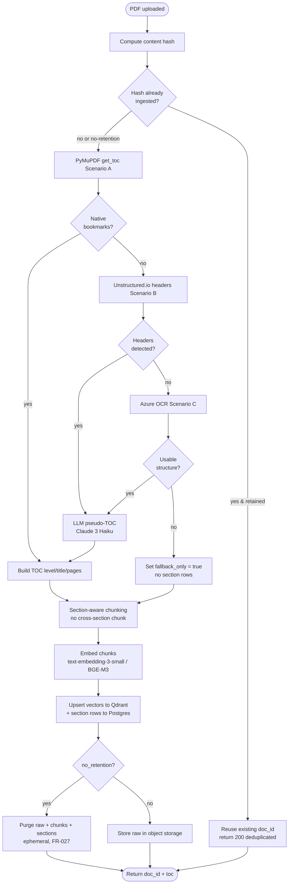

<!-- Generated by pipeline Step 13 - do not edit manually -->
<!-- Source: HLD §3.1 ingestion pipeline, ADR-4 Scenario A/B/C, OAQ-1/OAQ-6. Activities are real ingestion steps only. -->

# Activity Diagram — Ingestion Pipeline (ingest_document)

> Tiered A->B->C degradation and the OAQ-1 no-retention purge path are exactly as in HLD §3.1 / ADR-4. Truncation note: not applicable (< 50 nodes).
