<!-- Generated by pipeline Step 13 - do not edit manually -->
<!-- Source: HLD §4.4 component responsibilities + §6 DSA + §7 contracts. Function-level call graph of real HLD operations. -->

# Call Graph Diagram — RAG Refinement System

```mermaid
graph TB
    ingest["ingest_document(doc)"]
    parse["parse_toc()"]
    getoc["pymupdf.get_toc()"]
    pseudo["llm_pseudo_toc()"]
    ocr["azure_ocr()"]
    chunkfn["section_aware_chunk()"]
    embed["embed_chunks()"]
    upsert["qdrant_upsert()"]
    pginsert["pg_insert_sections()"]

    answer["answer_query(req)"]
    route["route_query(query, toc)"]
    cacheget["toc_cache.get()"]
    haiku["claude_haiku_route()"]
    gate["confidence_gate()"]
    retrieve["targeted_retrieve()"]
    fallback["fallback_retrieve()"]
    qsearch["qdrant_search(filter)"]
    rerank["cohere_rerank()"]
    generate["generate_answer()"]
    cite["build_citations()"]
    stab["interval_tree.stab(page)"]

    erase["delete_document(id)"]
    tomb["pg_tombstone()"]
    sweep["reconciliation_sweep()"]

    ingest --> parse
    parse --> getoc
    parse --> pseudo
    parse --> ocr
    ingest --> chunkfn
    chunkfn --> embed
    embed --> upsert
    ingest --> pginsert

    answer --> route
    route --> cacheget
    route --> haiku
    route --> gate
    answer --> retrieve
    answer --> fallback
    retrieve --> qsearch
    fallback --> qsearch
    retrieve --> rerank
    answer --> generate
    generate --> cite
    cite --> stab

    erase --> tomb
    erase --> sweep
    sweep --> qsearch
```

> Functions correspond to HLD §4.4 responsibilities, §6 DSA (interval-tree `stab`, LRU cache), and §7 contracts. `route_query` never calls `generate_answer` (HLD §7.2 invariant).
