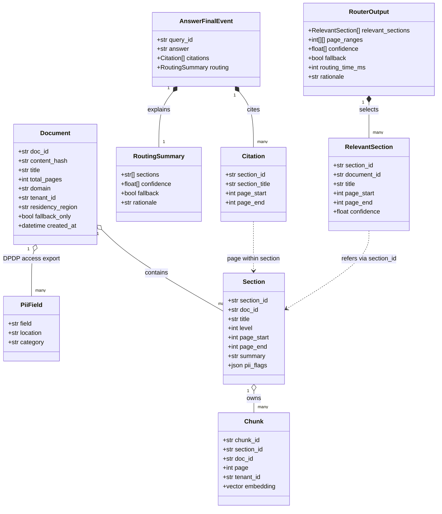

<!-- Generated by pipeline Step 13 - do not edit manually -->
<!-- Source: HLD §4 (data model), §7 (contracts), openapi.yaml schemas. Entities are real HLD/API classes only. -->

# Class Diagram — RAG Refinement System

> `section_id` is the universal join/filter key across Document -> Section -> Chunk (HLD §4, §7.5). Only Chunk is embedded into Qdrant; Document and Section live in PostgreSQL.
