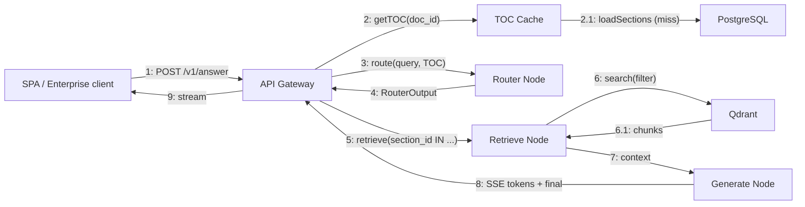

<!-- Generated by pipeline Step 13 - do not edit manually -->
<!-- Source: HLD §3.2 query pipeline message flow. Numbered messages between real HLD components only. -->

# Communication Diagram — Query Message Flow

> Message numbering reflects the HLD §3.2 call order. For `/v1/route`, messages stop at step 4 (RouterOutput); steps 5-9 are the `/v1/answer`-only path.
