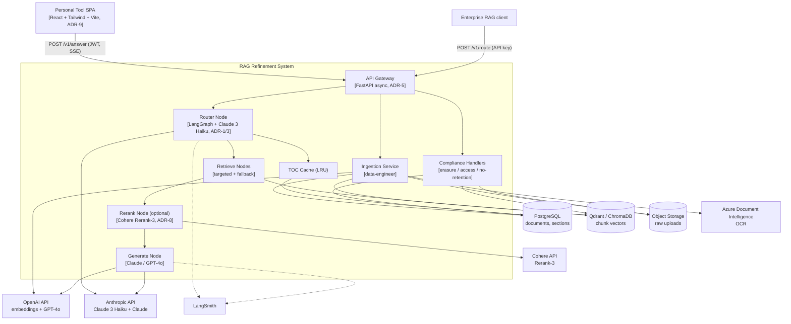

<!-- Generated by pipeline Step 13 - do not edit manually -->
<!-- Source: HLD §3.1 + §3.2 (C4 L2 containers), §2 (external providers). Components are real HLD containers only. -->

# Component Diagram — RAG Refinement System

> Invariant: the Router Node never calls the Generate Node for `/v1/route` (HLD §3.2, §7.2). All external providers are exactly those in HLD §2.
