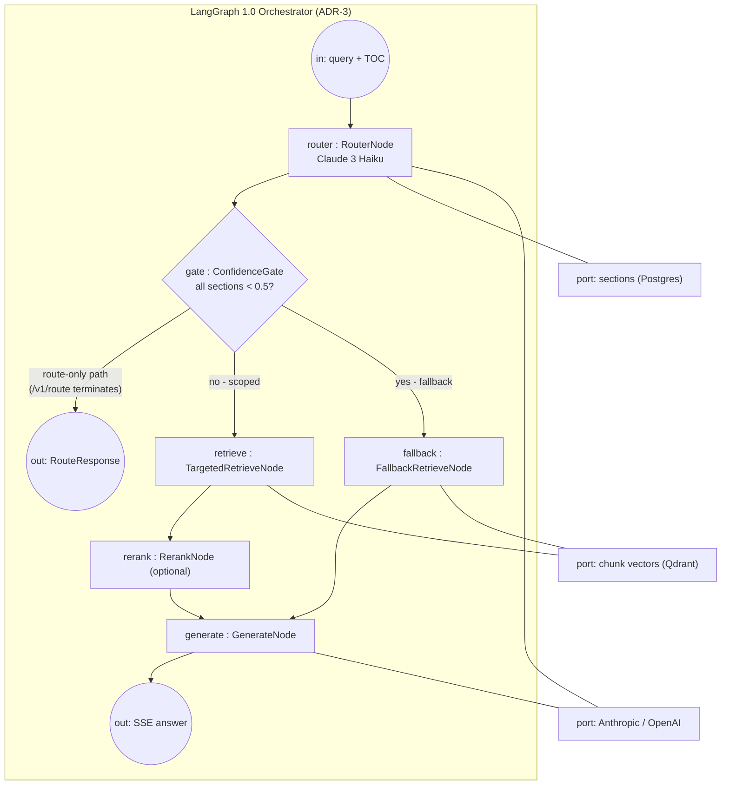

<!-- Generated by pipeline Step 13 - do not edit manually -->
<!-- Source: HLD §3.2 (LangGraph orchestrator internal structure), ADR-3. Internal parts are real HLD nodes only. -->

# Composite Structure Diagram — LangGraph Orchestrator

> Internal parts and the route-only termination port reflect HLD §3.2 graph topology exactly; `/v1/route` exits after the confidence gate (HLD §7.2).
