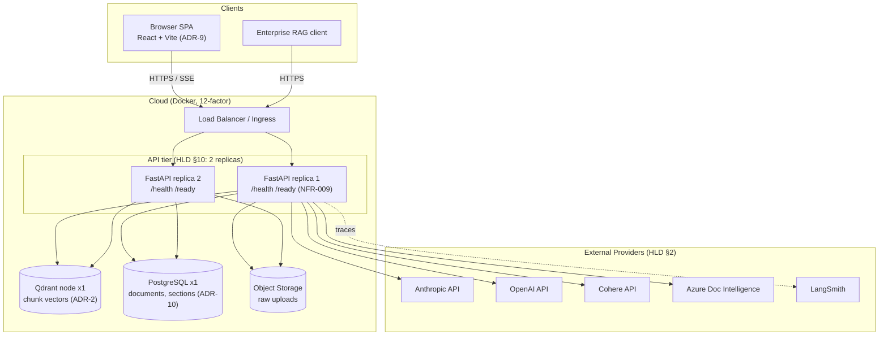

<!-- Generated by pipeline Step 13 - do not edit manually -->
<!-- Source: HLD §10 (2 API replicas + 1 Qdrant + 1 Postgres MVP sizing), §2 providers, ADR-2/5/10, NFR-009 probes. -->

# Deployment Diagram — RAG Refinement System (MVP topology)

> MVP sizing (2 API replicas + 1 Qdrant + 1 Postgres) is the HLD §10 Little's-Law result. India-residency tenants map to region-pinned Qdrant/Postgres/object-store instances (OAQ-5).
