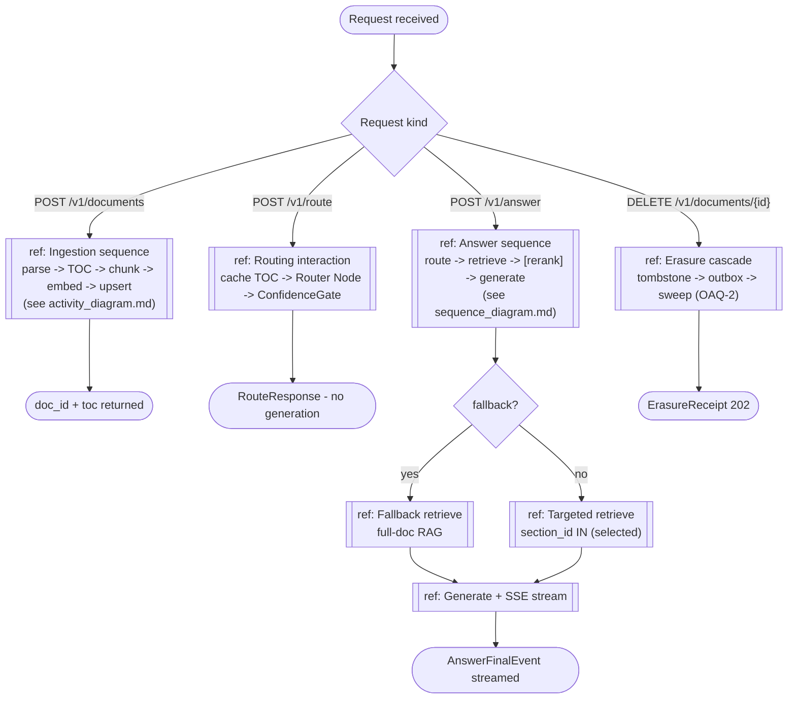

<!-- Generated by pipeline Step 13 - do not edit manually -->
<!-- Source: HLD §3.1 + §3.2 (ingestion and query sub-pipelines). Interaction-overview of real HLD flows only. -->

# Interaction Overview Diagram — Ingestion + Query

> Each `ref` frame points to the detailed sequence/activity diagram. Branches match HLD §3.1/§3.2 and the openapi.yaml operation set.
