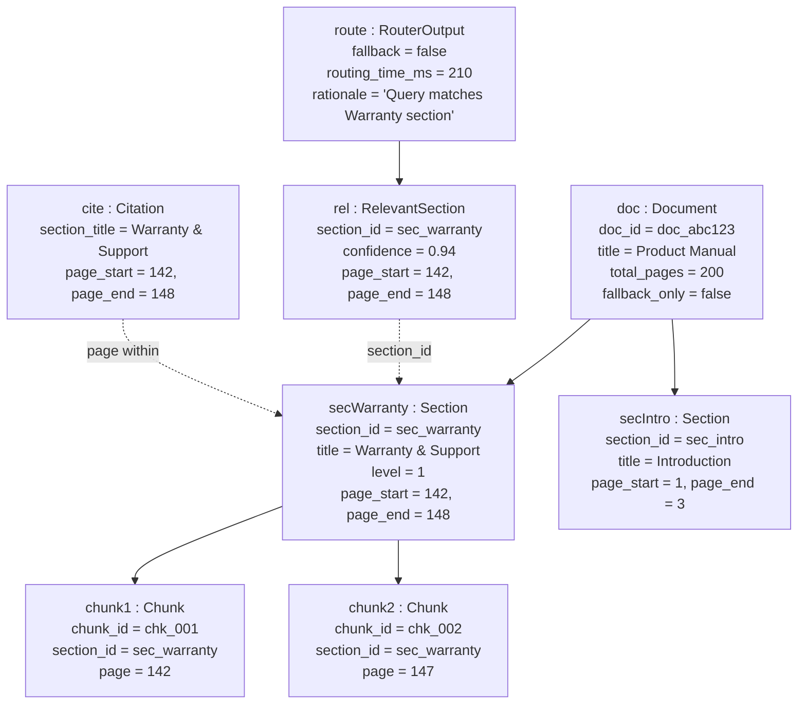

<!-- Generated by pipeline Step 13 - do not edit manually -->
<!-- Source: HLD §4 data model + PRD §8.2 TOC example (Warranty & Support, pp.142-148). Instances of real HLD classes. -->

# Object Diagram — RAG Refinement System (worked "warranty" example)

> Concrete instances of Document/Section/Chunk/RouterOutput/RelevantSection/Citation from the PRD §8.2 / §2.3 warranty example. No invented attributes.
