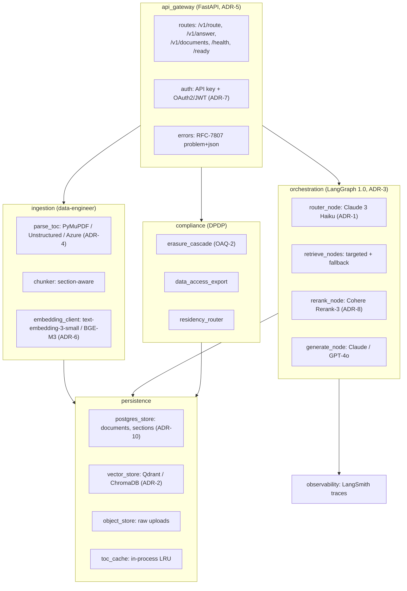

<!-- Generated by pipeline Step 13 - do not edit manually -->
<!-- Source: HLD §3 (containers), §4.4 (component responsibilities), ADR-3/4/5. Packages reflect real HLD components only. -->

# Package Diagram — RAG Refinement System

> Packages map 1:1 to HLD §4.4 component responsibilities. No package is invented beyond the HLD container set.
