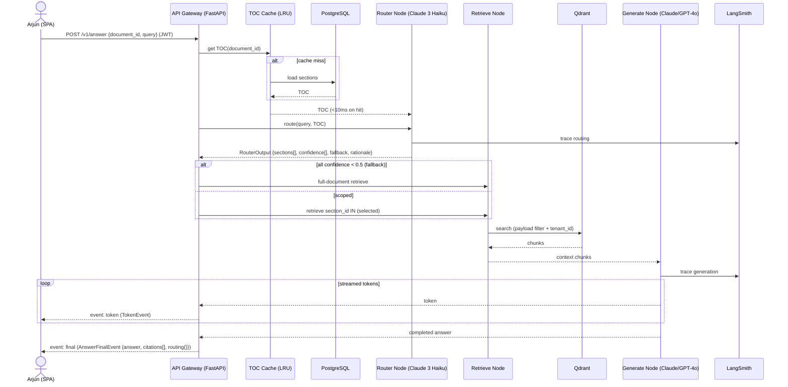

<!-- Generated by pipeline Step 13 - do not edit manually -->
<!-- Source: HLD §3.2 query pipeline, §7.3 /v1/answer SSE, openapi.yaml. Participants are real HLD components only. -->

# Sequence Diagram — /v1/answer (personal tool, SSE)

> Mirrors HLD §3.2 / §7.3. Router never calls Gen on the routing path; for `/v1/route` the flow stops at RouterOutput.
