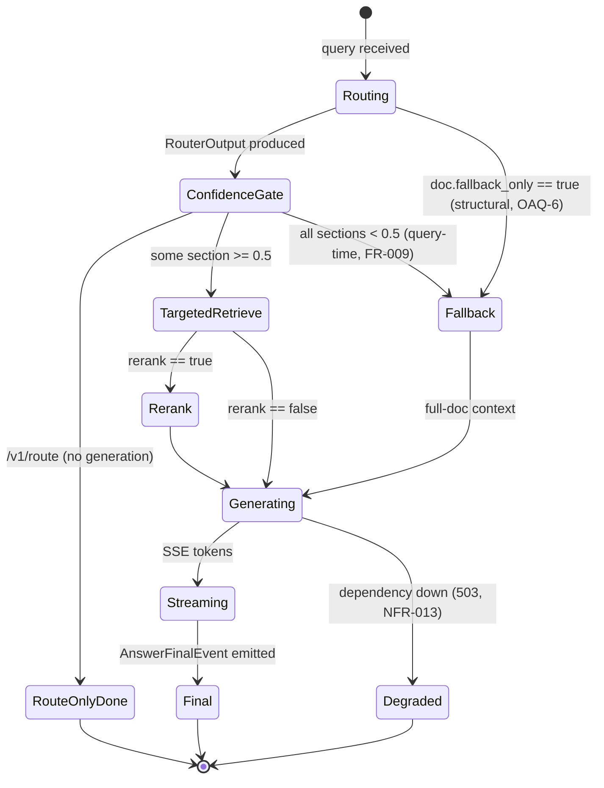

<!-- Generated by pipeline Step 13 - do not edit manually -->
<!-- Source: HLD §3.2 LangGraph state machine, OAQ-6 fallback triggers, ADR-3. States are real graph nodes only. -->

# State Diagram — LangGraph Query State Machine

> Two independent fallback triggers (structural `fallback_only` and query-time all-confidence-<0.5) both route to the Fallback state, per HLD OAQ-6.
