<!-- Generated by pipeline Step 13 - do not edit manually -->
<!-- Source: PRD §6 personas, §7 scope, FR-001..029; HLD §2 actors (U1 Arjun, U2 Priya, U3 DPO). Use cases trace to FRs. -->

# Use Case Diagram — RAG Refinement System

```mermaid
graph LR
    Arjun(("Arjun<br/>Power Researcher"))
    Priya(("Priya<br/>RAG Engineer"))
    DPO(("DPO / Data Subject"))

    UC1["Upload PDF (FR-001)"]
    UC2["Ask question / chat (FR-007)"]
    UC3["View cited answer (FR-008)"]
    UC4["See routing confidence (FR-011)"]
    UC5["View 'why look here?' panel (FR-012)"]
    UC6["Stream answer (FR-018)"]
    UC7["Route query only (FR-010)"]
    UC8["Multi-document route (FR-014)"]
    UC9["Manage document library (FR-024)"]
    UC10["Erase document (FR-025)"]
    UC11["Access personal data (FR-026)"]
    UC12["Enable no-retention (FR-027)"]
    UC13["Set India residency (FR-028)"]

    Arjun --> UC1
    Arjun --> UC2
    Arjun --> UC3
    Arjun --> UC4
    Arjun --> UC5
    Arjun --> UC6
    Arjun --> UC9
    Priya --> UC7
    Priya --> UC8
    Priya --> UC1
    Priya --> UC12
    Priya --> UC13
    DPO --> UC10
    DPO --> UC11

    UC2 -.includes.-> UC3
    UC3 -.includes.-> UC4
    UC2 -.extends.-> UC6
```

> Actors are exactly HLD §2 (Arjun=U1, Priya=U2, DPO=U3). Every use case traces to a PRD FR. No invented actor or capability.
